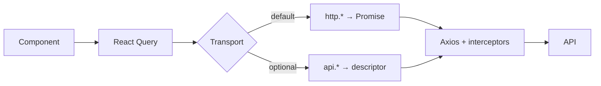

# API layer

> **Start simple with `http.get`, scale to request descriptors (`api.*`) when your app grows.**  
> **`requestOptions`**, **`coreHttp` / `coreApi`**, and **query key prefixes** are optional — you can ignore them until you need them.

The HTTP stack under **`src/lib/api/`** wires **Axios** (interceptors, refresh queue, error normalization) to thin helpers: **`http`** returns **`Promise<T>`** by default; **`api`** is the same transport with an optional **descriptor** shape for larger apps. TanStack Query uses **array-shaped** `queryKey`s everywhere.

---

## Quick start

The smallest useful pattern — no **`requestOptions`**, no shared prefixes, no **`queryOptions`** wrapper required:

```tsx
import { useQuery } from "@tanstack/react-query";
import { http } from "@/lib/api/http";

useQuery({
  queryKey: ["posts"],
  queryFn: () => http.get("/posts"),
});
```

To **cancel** in-flight work when the query unmounts or refetches, pass React Query’s **`signal`** into **`http.get`** (recommended for real screens):

```tsx
useQuery({
  queryKey: ["posts"],
  queryFn: ({ signal }) => http.get("/posts", { signal }),
});
```

That is enough for many apps. **`requestOptions`** (optional per-request config), **`api.get`** (descriptors), and **`coreHttp`** (second base URL) are **advanced** — see [Advanced usage](#advanced-usage) when you need them.

---

## Common usage

### `queryOptions` factory (shareable, typed)

Export a factory so **`useQuery`**, **`prefetchQuery`**, and server helpers reuse the same key + **`queryFn`** ([Query options](https://tanstack.com/query/v5/docs/framework/react/guides/query-options)):

```ts
import { queryOptions } from "@tanstack/react-query";
import { http } from "@/lib/api/http";

type Post = { id: number; title: string; body: string };

export const postsQueryOptions = (limit: number) =>
  queryOptions({
    queryKey: ["posts", "list", limit] as const,
    queryFn: ({ signal }) =>
      http.get<Post[]>("/posts", {
        signal,
        params: { _limit: limit },
      }),
  });
```

Still no **`requestOptions`** required — defaults handle auth headers and interceptors unless you opt in per call.

### Query key prefixes (group invalidation)

A **query key prefix** is just the **first part(s)** of every `queryKey` for one “family” of requests (same endpoint or resource). Then **`queryClient.invalidateQueries({ queryKey: prefix })`** clears every query whose key **starts with** that prefix.

This repo exports helpers such as **`postsQueryPrefix`** from **`src/lib/api/query-keys.ts`**. Feature code like **`src/features/posts/api/get-posts.ts`** builds keys as **`[...postsQueryPrefix, { _limit: limit }]`** so invalidation stays aligned with descriptor-backed keys if you mix patterns later. **You do not have to use these helpers** on day one — a plain **`["posts", "list", limit]`** key is valid; adopt prefixes when broad **`invalidateQueries`** matters.

---

## Core concepts

### Request flow

**Component** → **React Query** (`useQuery` / `useMutation`, **`queryFn`**) → **`http`** (default) **or** **`api`** (advanced descriptors) → **Axios** (`apiClient`, interceptors) → your **API**.

- Use **`http.get` / `http.post` / …** for the **simple** path: one URL, **`Promise<T>`**, optional second-argument object for **`params`**, **`signal`**, **`data`**, and later **`requestOptions`** if needed.
- Use **`api.get` / `api.post` / …** when an **advanced** flow benefits from a single object with **`{ fetch, cancel, queryKey }`** (shared keys, explicit **`cancel()`**, passing the descriptor through a pipeline). Same interceptors and errors as **`http`**.



### Two base URLs (optional)

**You can ignore this until you have a second backend.** **`BASE_URLS.default`** comes from **`NEXT_PUBLIC_API_BASE_URL`**; **`BASE_URLS.core`** from **`NEXT_PUBLIC_API_CORE_URL`** (or the same as default). **`coreHttp`** / **`coreApi`** / **`coreApiClient`** target the core URL; when both URLs are identical, the stack reuses one Axios instance (no duplicate interceptors).

---

## Advanced usage

**You can ignore everything below until you need it.** It does not change the simple path above.

### Optional request config (`requestOptions`)

Per-call flags passed as **`requestOptions`** on **`http.get(url, { …, requestOptions })`** or inside **`api.get({ …, requestOptions })`**. Think of them as **optional request config** layered on top of Axios.

Most common cases:

| Option | Default | When to touch it |
| ------ | ------- | ---------------- |
| **`secure`** | `true` | Set **`false`** for public routes so no `Authorization: Bearer` is sent. |
| **`skipAuthRefresh`** | `false` | Set **`true`** with public reads so 401/403 does not trigger the refresh flow. |
| **`sendAppHeaders`** | `true` | Set **`false`** to skip OS / locale / country headers from the client factory. |

Full field list: [RequestOptions (full reference)](#requestoptions-full-reference).

### Request descriptors

**`api.get<T>({ url, params })`** returns **`ApiRequestDescriptor`**: **`{ fetch, cancel, queryKey }`**. Use it when you need **`descriptor.cancel()`** outside React Query’s **`signal`**, guaranteed **`queryKey` + `fetch`** coupling, or passing one object through orchestration code. **`postsService.listDescriptor`** in **`src/features/posts/api/posts.service.ts`** is the sample.

The type name **descriptor** means “one request, packaged”: loader + cancel + cache key. You can stay on **`http`** only for most screens.

### Naming note

Older internal comments mentioned a legacy transport label; behavior here is the same — **request descriptor** + **`http`** is the vocabulary going forward.

---

## Reference

### Public exports (overview)

| Export | File | Role |
| ------ | ---- | ---- |
| `http`, `coreHttp` | `http.ts` | **`get` / `post` / …** → **`Promise<T>`** |
| `api`, `coreApi` | `http.ts` | Descriptor **`{ fetch, cancel, queryKey }`** per call |
| `apiClient`, `coreApiClient` | `http.ts` | Raw Axios |
| `postsQueryPrefix`, `usersQueryPrefix` | `query-keys.ts` | **Prefix** segments for **`invalidateQueries`** |
| `tokenStore` | `token-store.ts` | Token read/write |
| `BASE_URLS`, `HEADERS`, … | `constants.ts` | URLs and header names |
| `serializeParams` | `serialize-params.ts` | Query serialization for `paramsSerializer` |
| `normalizeErrorPayload`, `toApiError`, `toAuthError` | `errors.ts` | Error mapping |

### RequestOptions (full reference)

| Field | Default | Meaning |
| ----- | ------- | ------- |
| `secure` | `true` | When not `false`, attach `Authorization: Bearer` if a token exists. |
| `sendAppHeaders` | `true` | When not `false`, send `os` and optional locale/country from `ApiClientConfig`. |
| `sendCartUuid` | `false` | When `true`, set `Cart-UUID` if `getCartUuid` is configured. |
| `skipAuthRefresh` | `false` | When `true`, skip refresh + retry on **401** / **403**. |

### Interceptors

- **`withCredentials: false`** on every request.
- **`paramsSerializer`** → `serializeParams` (arrays as `key[]=…`).
- **FormData:** strip default `Content-Type` so Axios sets multipart boundary.
- **401 + 403:** single-flight refresh queue, then retry once (when refresh is configured).
- **412:** clear tokens + `onAuthFailure` + `AuthError` (`precondition_failed`).
- **Network / timeout:** one delayed retry (`_networkRetried`), then `ApiError` with `NETWORK_ERROR`.

Interceptors **do not show toasts** — see **[api-error-handling.md](./api-error-handling.md)** for final vs silent failures.

### Auth and refresh (placeholder)

`refreshTokens` in `http.ts` is a **stub** — replace with your real endpoint (see `REFRESH_PATH` in `constants.ts`).

### Legacy import

`src/lib/http/api-client.ts` re-exports `apiClient` from `@/lib/api/http`.

---

## Related documents

| Topic | Document |
| ----- | -------- |
| React Query | [data-fetching-and-react-query.md](./data-fetching-and-react-query.md) |
| Error handling | [api-error-handling.md](./api-error-handling.md) |
| Architecture | [architecture.md](./architecture.md) |
| Env | [env-configuration.md](./env-configuration.md) |
