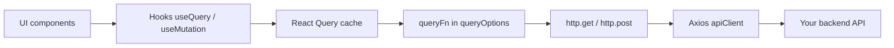

# Feature blueprint

**Canonical reference** for how product features are structured in this repo. **Posts** (`src/features/posts/`) and **Users** (`src/features/users/`) implement this blueprint end-to-end; copy them before inventing a new shape.

**Auth** (`src/features/auth/`) follows the same **`api/` · `hooks/` · `ui/` · `types/`** contract plus a dedicated **`session/`** folder for the **Auth Session Facade** (orchestration only — see [auth-system.md](./auth-system.md)). Use it as the reference for **login**, **logout**, **`me`**, and **RBAC** wiring, not for generic CRUD patterns.

---

## Folder structure

```txt
src/features/<domain>/
  api/
    get-<resources>.ts       # list: getX + xQueryOptions (+ optional shared request options import)
    get-<resource>-by-id.ts  # detail: getXById + xByIdQueryOptions (when needed)
    <domain>.service.ts      # optional: shared RequestOptions + api.get descriptor for advanced docs
  hooks/
    use-<resources>.ts       # useQuery(list options)
    use-<resource>.ts        # useQuery(detail options), enabled when id is valid
  ui/
    <resources>-list.tsx     # list UI: loading / error / empty / data
    <resource>-card.tsx      # row / card (optional)
    <resource>-detail.tsx    # detail view (optional)
  types/
    <resource>.types.ts      # domain types + re-exports if needed
  index.ts                   # barrel: what the rest of the app imports
```

Routes under `src/app/[locale]/` stay thin: they validate params/locale and render feature UI.

---

## Responsibilities by layer

| Layer        | Owns                                                                                                   | Does **not** own                                                                                                   |
| ------------ | ------------------------------------------------------------------------------------------------------ | ------------------------------------------------------------------------------------------------------------------ |
| **`types/`** | Domain shapes your API returns (or a mapped subset).                                                   | React Query keys, HTTP URLs (except as string docs in comments).                                                   |
| **`api/`**   | `http.get` / `http.post`, `queryOptions` factories, optional descriptor + `requestOptions` on service. | UI state, `useQuery` calls.                                                                                        |
| **`hooks/`** | Thin `useQuery` / `useMutation` wrappers calling shared `queryOptions` / mutation helpers.             | Layout, toasts (unless you intentionally wire `meta` documented elsewhere), business rules that belong in backend. |
| **`ui/`**    | Presentation, empty/loading/error states, user actions that call **hooks** or pass callbacks.          | Direct `http`, `apiClient`, or raw `fetch` to your API.                                                            |

---

## Required files (minimum shippable feature)

For a read-only list + optional detail (same as Posts/Users):

1. `types/*.types.ts` — at least one exported domain type.
2. `api/get-*.ts` — `get…` + `…QueryOptions` with **`http.get`** and **`signal`** in `queryFn`.
3. `hooks/use-*.ts` — **`useQuery`** only, no duplicated query key strings.
4. `ui/*-list.tsx` — consumes hook(s) only.
5. `index.ts` — exports what routes and other features need.

Add **`get-*-by-id.ts`**, **`use-*.ts`**, **`*-detail.tsx`**, and **`app/[locale]/.../[id]/page.tsx`** when you need a detail screen.

---

## Rules (non-negotiable)

1. **UI never calls the API layer directly** — no `http` / `apiClient` / `api.get` inside `ui/`. Use hooks.
2. **One source of truth for query keys** — define keys inside **`queryOptions`** factories in `api/`, not scattered in components.
3. **`queryFn` uses `http` by default** — use **`api`** descriptors only when you have a concrete need (see [api-layer.md](./api-layer.md#advanced-usage)).
4. **Hooks stay thin** — if logic grows, extract pure helpers in `api/` or `lib/`, not fat hooks.
5. **Cross-feature imports** — prefer importing from another feature’s **`index.ts`** if you must share; avoid reaching into deep paths unless necessary.

---

## Consistent feature pattern

This project uses the **same layout and naming rhythm** for every feature module so that:

- onboarding stays **predictable** (learn Posts once, Users confirms the pattern);
- **grep** and code review scale — reviewers know where to look;
- **invalidateQueries** and prefetch stay aligned because keys and `queryOptions` live together in `api/`.

Large apps fracture when every team picks a different folder shape. Here, **consistency is a product decision**: treat **`features/*`** as internal micro-frontends that all speak the same language.

---

## Data flow (mental model)



- **`http.*`** — default path: simple typed calls from `queryFn` / `mutationFn`.
- **`api.*` (descriptors)** — optional: use when **`{ fetch, cancel, queryKey }`** together is worth it ([api-layer.md](./api-layer.md)).

For the full stack (errors, toasts, interceptors), see [architecture.md](./architecture.md#request-lifecycle-browser--api).

---

## Common mistakes to avoid

| Mistake                                                                           | Why it hurts                                                                           | Instead                                                            |
| --------------------------------------------------------------------------------- | -------------------------------------------------------------------------------------- | ------------------------------------------------------------------ |
| `useQuery({ queryKey: [...], queryFn: () => http.get(...) })` only in a component | Keys drift from prefetch / invalidation; duplicate logic.                              | Centralize in **`queryOptions`** in `api/`.                        |
| Calling `http.get` in `ui/` “just once”                                           | Breaks separation; hard to test; bypasses shared options (`signal`, `requestOptions`). | **`useX`** hook + **`queryOptions`**.                              |
| Descriptor (`api.get`) everywhere on day one                                      | Steeper learning curve; often unnecessary.                                             | Start with **`http`**; add descriptors where they earn their keep. |
| Skipping **`signal`** in `queryFn`                                                | Wasted network when the user navigates away.                                           | `queryFn: ({ signal }) => http.get(url, { signal, ... })`.         |

---

## FAQ

**Should I use descriptors (`api.get`) or `http.get`?**  
Default to **`http.get`** (or `post`, etc.) inside **`queryOptions`**. Use **`api.get`** when you want a single object that carries **`queryKey`**, **`fetch`**, and **`cancel`** for orchestration or advanced cancellation — [api-layer.md](./api-layer.md#request-descriptors).

**Where do query key prefixes live?**  
In **`src/lib/api/query-keys.ts`** when you want **`invalidateQueries`** to match both hand-rolled keys and descriptor-style keys. Optional for small apps.

**Can a feature import another feature?**  
Yes, sparingly — import from **`@/features/other`** barrel (`index.ts`) and keep domains loosely coupled.

**Where do Server Components fetch?**  
This blueprint focuses on **client** React Query flows. For RSC data, you can still call **`getX`** functions from `api/` without `useQuery`; keep server fetchers in or next to `api/` for the same single source of truth.

---

## See also

- [getting-started.md](./getting-started.md) — fast path + copy-paste template
- [architecture.md](./architecture.md) — global layers and request lifecycle
- [api-layer.md](./api-layer.md) — `http`, interceptors, descriptors
- [auth-system.md](./auth-system.md) — session facade, cookies vs `tokenStore`, refresh
- [data-fetching-and-react-query.md](./data-fetching-and-react-query.md) — `queryOptions`, devtools, toasts

**Core stack:** [Documentation index](./README.md) · [Architecture](./architecture.md) · [API layer](./api-layer.md) · [Auth](./auth-system.md)
